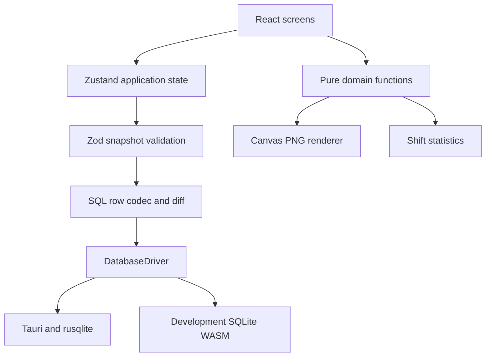

# Architecture — Teacher Workspace V1

## V1.3 module extension

AI Tools is lazy-loaded through the existing navigation/screen registry. Its domain owns LaTeX diagnostics, typed review reports and prompt templates; provider and credential adapters are separate from React. SQLite's existing `settings.moduleState.aiTools` stores a versioned, bounded payload through the same atomic commit/revision guard. There is no schema change to existing calendar tables. Windows Credential Manager stores Gemini credentials outside SQLite and every backup path. Browser preview credentials live in RAM only. See [AI_TOOLS.md](AI_TOOLS.md) for privacy boundaries, scope and future table migration strategy.

The provider returns schema-validated text data, never executable HTML/TeX. Online requests require explicit confirmation and support cancellation/timeout. Review corrections require a second confirmation and an unchanged source snapshot. Static checks never claim mathematical proof or successful TeX compilation.

## Product boundary

Offline-first Windows desktop. The scheduler owns work definitions, recurrence rules and occurrence exceptions. Reporting consumes generated occurrences. The app shell owns navigation and coordinates UI; it does not calculate recurrence or execute SQL. Future modules are not represented by fake buttons or empty implementations.

## Layers and dependency direction

Domain imports no React, Zustand, database or filesystem API. Date arithmetic has one owner in `core/time.ts`. React pages read immutable snapshots and dispatch commands. The database snapshot includes bounded rules and exceptions, not generated occurrences.

## Domain

- **ScheduleWorkspace**: named calendar space and archive state.
- **WorkItem**: reusable class/task identity, category, location, notes, curated/custom color, archive metadata.
- **ScheduleRule**: per-work-item recurrence, `seriesId`, weekdays, civil start/end times, inclusive date bounds, interval and anchor.
- **ScheduleOccurrence**: projection for a requested range. Identity derives from original rule/date; makeup uses its exception ID.
- **ScheduleException**: one overriding record for a rule/date, or an additive makeup with its own identity. Stores effective date/time, explicit status, note and deletion tombstone.
- **Settings**: theme, visible hours, density, snap, color strategy and selected workspace.

Types and Zod validators are colocated. Whole-snapshot checks enforce unique IDs, foreign-key graph membership, one work item per series, unique non-makeup overrides, and valid original occurrence references. SQLite adds a second defense for relations and time constraints.

Time uses `YYYY-MM-DD` and zero-padded `HH:mm`, compared as validated civil values. Stored wall-clock schedules intentionally do not shift when converted through ISO timestamps. Timestamps for audit metadata are separate ISO UTC strings. Timezones/overnight events are explicit extension work, not implied support.

## Database and migrations

Normalized SQLite tables are defined in `src/database/migrations/001_initial.sql`. Desktop Rust includes the same SQL source consumed by the browser test adapter, preventing schema drift.

`PRAGMA user_version` is the migration cursor. New migrations receive increasing numbers. Apply each within a transaction; do not rewrite a shipped migration. Reject databases newer than the supported schema. Before future nontrivial migrations, add a pre-migration SQLite online backup and failure/rollback fixture tests. V1 migration creates a new database only.

Desktop: one Mutex-protected connection, WAL, foreign keys, synchronous FULL and busy timeout. The single-instance plugin focuses an existing window; revision checks remain the final guard against concurrent writes. Read all definitions at startup; do not query once per event or grid cell.

Frontend `diff` emits row mutations. Deletion order is child-to-parent; upsert order is parent-to-child. The Rust command allows only known tables and complete allowed column sets and binds all values as parameters. It never accepts arbitrary SQL from UI. Failed writes roll back and do not publish a new UI snapshot.

The web adapter is an explicit development adapter, not a LocalStorage fallback. It loads real SQLite WASM, uses the same migration and queries, saves exported DB bytes to IndexedDB, and uses Web Locks around reload/check/commit/persist. Multiple tabs cannot silently overwrite newer revisions. IndexedDB transaction completion is awaited before updating Zustand.

## State and services

`useWorkspace` owns hydrated data, revision, load error, save progress and commit. A commit is pessimistic: calculate next snapshot → validate → generate diff → persist transaction → publish state. Inputs remain in component-local state until accepted. A busy guard prevents concurrent UI mutations.

`useUi` owns navigation, focused week and modal requests; these are not teaching records. Toasts live separately and do not rerender calendar data. Screen code is lazy-loaded. Calendar occurrence generation and conflict maps are memoized by snapshot/range. Grid and event blocks use memoization; transient pointer updates do no SQL work. There is no premature virtualization dependency for a seven-day grid.

`services/files.ts` chooses the native selected-file dialogs or browser development download/input. No broad filesystem permissions are granted by the app capability. `services/backup.ts` owns JSON serialization, version checking and size limit. Import stages validated data in a confirmation dialog and exports the current data before a single replacement transaction.

## Recurrence strategy

Supported strategies: `once` and `weekly` with interval 1–52. `anchorDate` is separate from the lower bound so a midweek split cannot reset a biweekly phase. Week begins Monday.

Algorithm for a query range:

1. Validate finite bounds; select rules for the requested workspace.
2. Index exceptions by rule in linear time.
3. Iterate only candidate civil days in the intersection of requested/rule bounds.
4. Evaluate strategy and overlay the single overriding exception for each original date.
5. Include relevant exceptions moved into the range from outside, and additive makeup sessions, even beyond the rule end date.
6. Remove tombstones, filter by effective date, deduplicate identities and sort.

Never materialize all future occurrences in the database. Ranges are capped at 3,660 day differences to prevent accidental unlimited expansion; individual rule end dates can remain unbounded.

## Exception and editing semantics

| Scope          | Data operation                                                                                      |
| -------------- | --------------------------------------------------------------------------------------------------- |
| One            | Upsert override by original rule/date; makeup edits update that makeup only                         |
| Future         | Split affected series segments at original date, retain historical segments, move future exceptions |
| Weekday future | Split selected weekday into edited branch and keep other weekdays in an unchanged branch            |
| All            | Update all segments sharing seriesId; keep explicit effective dates/times of exceptions             |

Day movement is relative to the rendered occurrence. The pivot for a future edit is the original occurrence date, clearly described in the dialog, even if that occurrence has been rescheduled. Moving an entire series shifts its bounds, anchor and weekday set consistently. Exceptions reparent to new rule IDs and shift original reference dates while preserving their absolute effective date/time.

“Completed” is explicit, not inferred from the clock. Makeup provenance (`isMakeup`) is independent of completion status. Cancellation and skipping remove time occupancy but remain in history. Deletion creates a tombstone for one generated occurrence; series deletion removes definitions and related exceptions only after confirmation.

Changes are immutable and validated before persistence. Persisted partial unique indexes prevent multiple overriding exceptions for the same original occurrence.

## Conflicts and calendar layout

Conflict intervals are half-open: `[start, end)`. End-to-start adjacency is valid. Cancelled/skipped ca do not occupy time. A sorted per-day sweep compares overlapping candidates and builds a bidirectional conflict map. Calendar layout partitions each connected interval group into columns, including nested and chained overlaps.

`top = (startMinute - visibleStartMinute) × pixelsPerMinute` and `height = durationMinute × pixelsPerMinute`. Inputs do not snap; pointer operations use the configured snap. Pointer capture supports dragging beyond block edges. Source records remain unchanged until the scope dialog is submitted. A minimum visual border for an extremely short ca does not modify its stored duration.

Conflicts are always shown for the displayed week. The new-work form additionally checks the first eight weeks and warns after save; it does not claim exhaustive conflict prediction over an infinite recurrence horizon. A future interval/number-theory strategy can add that feature independently of the calendar.

## Export engine

`renderScheduleImages(input)` produces fresh Canvas pages from domain data. It uses no DOM capture or screenshot APIs. It calculates its own columns, time range and overlap partition. Six exact pixel presets, four styles and three output media are implemented.

All text is measured/wrapped. A ca too short or narrow to contain the selected fields receives a reference code; complete content goes to paginated companion PNGs. Long notes continue across pages instead of disappearing. PNG encoding adds a valid 300-dpi `pHYs` chunk with CRC32. The preview is the actual canvas that represents the export, not a mock layout.

Monochrome export has white background, visible borders, hatch accent and numeric references. Color print suppresses a dark background. UI theme does not determine export theme. No remote images, fonts, APIs or CORS resources are needed.

## Extension points

1. **New screen**: implement a lazy component and register it in `app/navigation.ts` and `app/App.tsx`.
2. **New module**: add its own domain/service/UI files. Import shared IDs/time utilities; do not import schedule UI.
3. **New persistence slice**: add schema validation, a numbered migration, codec rows, backend table/column allowlist and transactional tests. Do not replace or serialize all database tables as one blob.
4. **Attendance / student records**: introduce stable occurrence references or a transactional relink mapping. `ruleId:date` changes on splits; consuming modules must not cache it without supporting relinking. Extend split transactions to move dependent records atomically.
5. **Salary / hours**: consume explicit completion and effective dates through the stats service, with a defined policy for makeup, cancelled and skipped sessions. Do not multiply the count of recurrence weekdays by the number of weeks.
6. **Monthly or RRULE recurrence**: implement a strategy with anchor semantics, discriminated configuration, backup/schema migration and tests for DST/civil date policies.
7. **Sync**: separate adapter, provider mapping, tombstones, local revision/outbox, conflict policy. No provider SDK in calendar UI.
8. **AI / LaTeX / exam tools**: separate modules; local-first defaults and explicit user-triggered network capabilities. No secrets in renderer state, backup or logs.
9. **Observability**: current errors remain local. Add opt-in diagnostic export with redaction; do not send classroom data to telemetry by default.

## Release gates

Before distributing a Windows binary: run native build/tests on Windows, launch the installed app, verify persistence across actual process restarts, native open/save dialogs, backup round trip, resize/DPI behavior, image export and uninstall/reinstall data retention. Check WebView2 first-run installation both with and without network, then sign the release if distributing to other users. These OS-specific checks cannot be replaced by browser tests.
